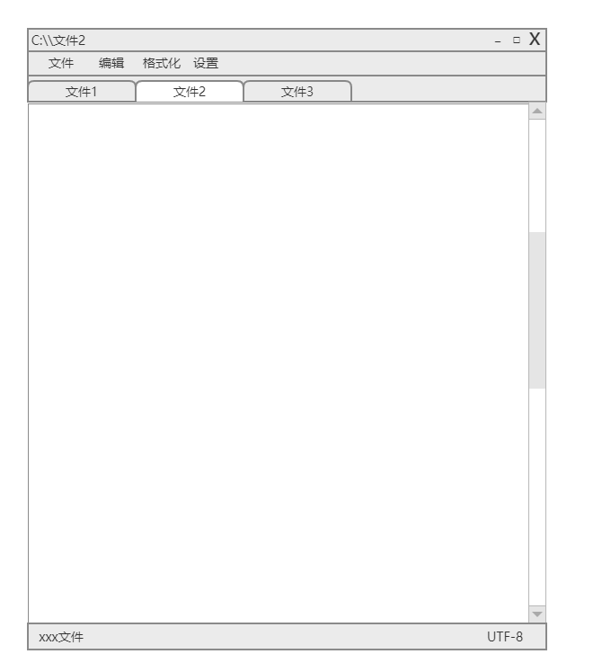

# gugugu-edit
咕咕咕-文本编辑器
## 原型

## 功能点
* [ ] file:文件操作封装
* [ ] window:窗体操作封装
* [ ] toolbar:菜单栏操作封装
* [ ] tab: 标签页操作封装
* [ ] textarea: 文本域操作封装
* [ ] setting: 配置操作封装
* [ ] statusbar: 状态栏操作封装
* [ ] plugins: 插件操作封装
## 技术栈
* go 1.6
* [therecipe/qt](https://github.com/therecipe/qt)
  * qt 5.13
* [spf13/viper](https://github.com/spf13/viper)
